# Gratitude Journal

## Overview
Gratitude Journal is a Django-powered web application designed to help users cultivate a daily gratitude practice through digital journaling. The back-end of the application is python-based and the front-end incorporates HTML, CSS, Javascript and Bootstrap 5. 

The platform provides a personal, secure space for users to record and reflect on what they're grateful for each day. Users are able to create, view, edit and delete their gratitude entries.

The application aims to promote mental well-being and positive thinking by making gratitude journaling accessible, engaging, and sustainable. Users can track their emotional journey, build consistent writing habits, and gain insights into their gratitude patterns over time.

## Table of Contents

- [Overview](#overview)
- [UX Design](#ux-design)
  - [User Stories](#user-stories)
    - [Must Haves](#must-haves)
    - [Should Haves](#should-haves)
    - [Could Haves](#could-haves)
  - [Wireframes](#wireframes)
  - [ERD](#erd)
  - [Colours](#colours)
  - [Font](#font)
- [Key Features](#key-features)
  - [User Authentication & Management](#user-authentication--management)
  - [Gratitude Entry Management](#gratitude-entry-management)
  - [Mood Tracking System](#mood-tracking-system)
  - [Dashboard Overview](#dashboard-overview)
  - [Search & Filter Capabilities](#search--filter-capabilities)
  - [Enhanced UX Features](#enhanced-ux-features)
  - [Data Management](#data-management)
- [Deployment](#deployment)
- [AI Implementation & Orchestration](#ai-impelementation--orchestration)
- [Testing](#testing)
  - [Desktop Lighthouse Reports](#desktop-lighthouse-reports)
  - [Mobile Lighthouse Reports](#mobile-lighthouse-reports)
  - [HTML Validation](#html-validation)
  - [CSS Validation](#css-validation)
  - [Python Validation](#python-validation)
  - [JavaScript Validation](#javascript-validation)
  - [Manual Testing](#manual-testing)
  - [Automated Testing](#automated-testing)
- [Future Enhancements](#future-enhancements)
- [Credits](#credits)

## UX Design

### User Stories

The user stories for the Gratitude Journal application have been carefully crafted to ensure the development process remains user-centered and focused on delivering real value to people seeking to build a meaningful gratitude practice. These stories serve as the foundation for feature development, testing criteria, and project prioritization.

Each user story follows the standard Agile format: "As a [type of user], I want [some goal] so that [some reason]." The user stories are organized using the MoSCoW method to guide development priorities.

#### Must Haves

**User Story 1: User Registration and Authentication**

As a new user, I want to create an account and log in securely so that I can have a personal, private space for my gratitude journal.  

**Acceptance Criteria:**
- User can register with username, email, and password
- Password must meet security requirements (minimum length, complexity)
- User receives confirmation message upon successful registration
- User is automatically logged in after registration
- User can log in with username and password
-  User can log out securely
- User sessions are managed securely
- Failed login attempts show appropriate error messages

**User Story 2: Create Gratitude Entries**

As a logged-in user, I want to write and save gratitude entries so that I can record what I'm grateful for each day.  

**Acceptance Criteria:**
- User can access entry creation form from dashboard
- User can write gratitude content (minimum 10 characters, maximum 5000)
- User can select mood from predefined options (Excellent, Good, Okay, Difficult, Challenging)
- User can optionally add a title (max 200 characters)
- User can optionally add tags separated by commas
- User can set entry privacy (private/shareable)
- Form validates required fields before submission
- Character count is displayed in real-time
- User receives confirmation message upon successful creation
- User is redirected to entry detail view after creation

**User Story 3: View and Manage Personal Entries**

As a logged-in user, I want to view, edit, and delete my gratitude entries so that I can manage my personal gratitude journal.  

**Acceptance Criteria:**
- User can view a list of all their entries
- Entries are displayed with title, date, mood, and content preview
- User can click on an entry to view full details
- User can edit existing entries
- User can delete entries with confirmation prompt
- Only the entry author can view/edit/delete their entries
- Entry timestamps show creation and last modified dates
- Entries are sorted by newest first by default

**User Story 4: Dashboard Overview**

As a logged-in user, I want to see an overview of my gratitude journey so that I can track my progress and be motivated to continue.  

**Acceptance Criteria:**
- Dashboard shows total number of journal entries
- Dashboard displays recent entries (last 3)
- Dashboard shows mood distribution statistics
- User can navigate to create new entry from dashboard
- User can navigate to view all entries from dashboard
- Dashboard displays personalized welcome message
- Quick action buttons are prominently displayed

**User Story 5: User Profile Management**

As a logged-in user, I want to view and manage my profile information so that I can maintain my account details.  

**Acceptance Criteria:**
- User can view their profile information (username, name, email, join date)
- User can change their password
- Password change requires current password verification
- User receives confirmation after successful password change
- Profile shows last login date
- User can navigate back to dashboard from profile

#### Should Haves

**User Story 6: Search and Filter Entries**

As a user with many journal entries, I want to search and filter my entries so that I can quickly find specific entries or content.  

**Acceptance Criteria:**
- User can search entries by title, content, or tags
- User can filter entries by mood
- User can filter entries by date range
- User can sort entries by date, title, or mood
- Search results show number of matching entries
- User can clear all filters to return to full list

**User Story 7: Entry Pagination**

As a user with many journal entries, I want to navigate through my entries in manageable chunks so that the page loads quickly and is easy to browse.  

**Acceptance Criteria:**
- Entry list shows 10 entries per page
- Pagination controls are clearly visible
- User can navigate to first, previous, next, and last pages
- Current page number is highlighted
- Page numbers are clickable
- Pagination works with search and filter results
- URL reflects current page for bookmarking

**User Story 8: Enhanced User Experience Features**

As a user, I want to have a smooth and intuitive experience so that I enjoy using the gratitude journal regularly.  

**Acceptance Criteria:**
- Responsive design works on desktop, tablet, and mobile
- Keyboard shortcut (Ctrl+D for dashboard)
- Form auto-save functionality for long entries
- Character count displays for text fields
- Smooth transitions and hover effects
- Consistent styling and branding throughout

**User Story 9: Mood Tracking and Visualisation**

As a user, I want to track my mood patterns over time so that I can understand my emotional journey.  

**Acceptance Criteria:**
- Dashboard shows mood distribution statistics
- Mood icons are visually distinct and colorful
- Mood counts are displayed with visual indicators
- Recent entries show mood with appropriate colors
- Mood filter in entry list shows all available moods
- Mood statistics exclude zero counts for cleaner display

#### Could Haves

**User Story 10: Gratitude Prompts and Inspiration**

As a user, I want to receive daily gratitude prompts so that I have inspiration when I'm unsure what to write about.  

**Acceptance Criteria:**
- Dashboard displays a daily gratitude prompt
- Prompts rotate and provide variety
- Prompts are thoughtful and engaging
- User can refresh to get a new prompt
- Prompts are stored in database for consistency
- Different prompts for different moods or themes

**User Story 11: Streak Tracking**

As a user, I want to track my writing streak so that I stay motivated to write regularly.  

**Acceptance Criteria:**
- Dashboard shows current writing streak (consecutive days)

**User Story 12: Entry Templates and Quick Entry**

As a busy user, I want to have quick ways to create entries so that I can maintain my gratitude practice even on busy days.  

**Acceptance Criteria:**
- Pre-defined templates for common gratitude themes
- Quick entry mode with minimal fields
- Voice-to-text capability for mobile users
- One-click entry creation from prompts
- Templates can be customized by user
- Quick entry still captures essential data (mood, content)

### Wireframes

The wireframes for the Gratitude Journal application were created using Balsamiq Wireframes to visualize the user interface design and layout before development. These wireframes helped establish the information architecture, user flow, and responsive design considerations for both desktop and mobile experiences.

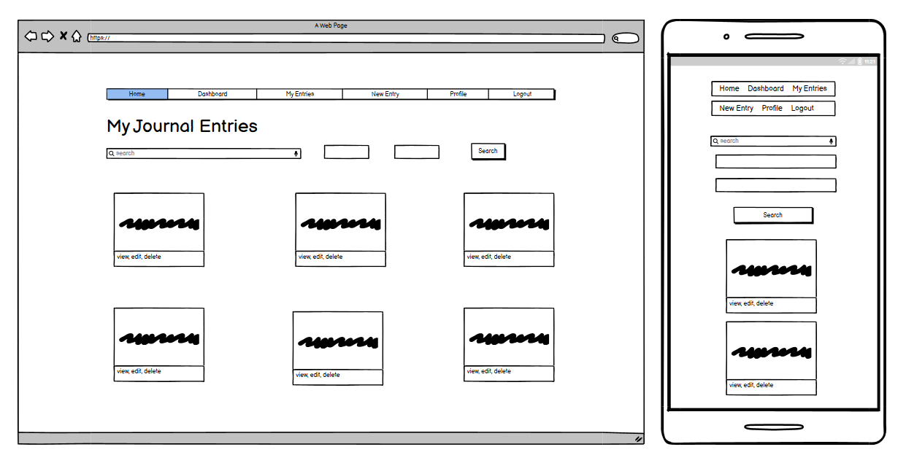

### ERD

The Entity Relationship Diagram (ERD) for the Gratitude Journal application was created using Lucid app to provide a clear visual representation of the database structure and relationships. This diagram serves as a crucial design document that illustrates how data is organized and connected within the application.

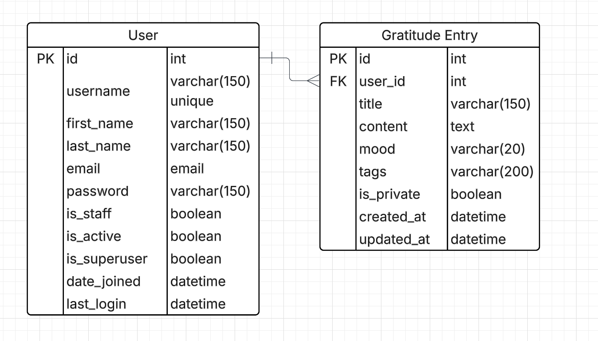

### Colours

The following colours are the main colours used in the gratitude journal. I chose vibrant colours to create a feeling of positivity and warmth.

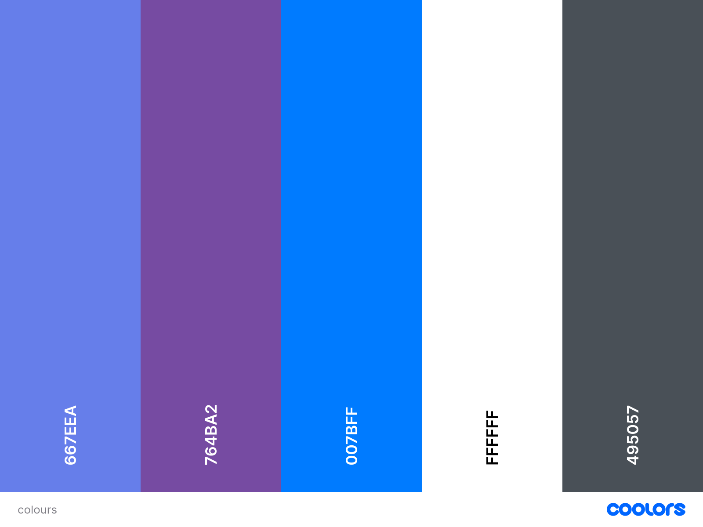

WCAG guidlines were adhereded to so that there was enough colour contrast. I tested the main font colour against the white background colour using a colour contrast checker, and it passed all tests.

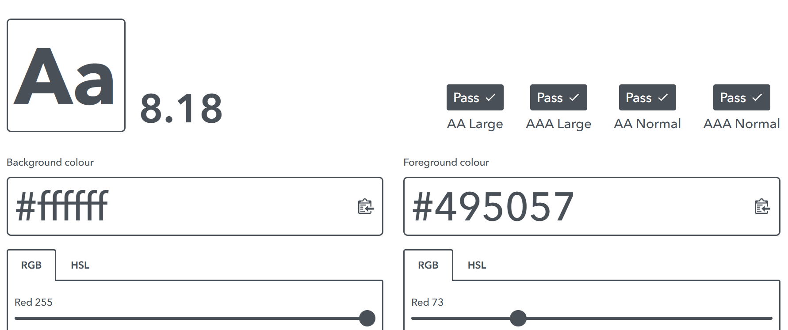

### Font

I used Segoe UI as the primary font. Segoe UI creates a clean, modern and highly readable interface that aligns with the calming and positive nature of the gratitude journaling application. The font weights are varied throughout the project for headings and subheadings.

# Key Features

## User Authentication & Management

The Gratitude Journal provides comprehensive user authentication and management capabilities, allowing users to register securely, log in with username and password combinations, and manage their personal profiles. Users can change their passwords with proper verification, view their account information including join dates and last login times, and maintain secure sessions throughout their journaling experience.

## Gratitude Entry Management

At the heart of the application is the gratitude entry management system, which enables users to create detailed journal entries with titles, content, mood selections, and custom tags. Users have full control over their entries, with the ability to view, edit, and delete them as needed. Each entry includes privacy settings, allowing users to keep their thoughts private or mark them as shareable for potential future features.

## Mood Tracking System

The mood tracking system is a distinctive feature that allows users to categorize their emotional state with each entry. Users can select from five mood options: Excellent, Good, Okay, Difficult, or Challenging, each represented by distinctive emoji indicators and color coding. This mood data is then aggregated to provide valuable insights into emotional patterns over time.

## Dashboard Overview

The dashboard serves as the central hub of the user experience, providing a personalized overview of the user's gratitude journey. It displays the total number of entries, shows previews of the three most recent entries, and presents mood distribution statistics in an easily digestible visual format. Quick action buttons make it simple to create new entries or browse through existing ones.

## Search & Filter Capabilities

The application includes robust search and filtering capabilities that help users navigate their growing collection of entries. Users can search through titles, content, and tags, filter entries by mood or date ranges, and sort their results by various criteria. The system provides clear feedback on search results and offers easy ways to clear filters and return to the full entry list.

## Enhanced UX Features

Enhanced user experience features make the application enjoyable and efficient to use daily. The responsive design ensures optimal functionality across desktop, tablet, and mobile devices. Interactive elements include keyboard shortcuts for quick navigation, form auto-save functionality to prevent data loss, real-time character counting for content fields, and smooth animations and transitions that create a polished, professional feel.

## Data Management

Data management capabilities include comprehensive timestamping for both creation and modification dates, a flexible tag system that accepts comma-separated input, and robust content validation that ensures entries meet minimum and maximum length requirements. The system automatically sorts entries by date to show the most recent content first, making it easy for users to see their latest thoughts and progress.

# Deployment

The Gratitude Journal application was deployed to Heroku using a systematic approach that ensures production-ready performance and security. The deployment process began with configuring the Django settings to handle both development and production environments seamlessly.

**Environment Configuration:** The project uses environment variables to manage sensitive information and configuration settings. Database credentials, secret keys, and other sensitive data are stored as Heroku config vars rather than being hardcoded in the application files. This approach maintains security while allowing the application to adapt to different deployment environments.

**Database Setup:** The application transitions from SQLite for local development to PostgreSQL for production on Heroku. This change provides better performance, reliability, and scalability for the live application. The database configuration automatically detects the environment and uses the appropriate database backend.

**Static File Management:** Static files are handled using WhiteNoise middleware, which was specifically configured to serve CSS, JavaScript, and image files efficiently in production. This eliminates the need for a separate static file server and ensures that the purple gradient background and all styling elements load correctly in the deployed version.

**Production Settings:** The deployment includes production-optimized settings such as proper ALLOWED_HOSTS configuration, debug mode disabled, and secure static file serving. The STATICFILES_DIRS configuration was carefully adjusted to work with Heroku's file system structure, ensuring all custom CSS and JavaScript files are properly served.

**Deployment Process:** The application is deployed using Git integration with Heroku, allowing for easy updates and version control. Dependencies are managed through the requirements.txt file, ensuring all necessary packages are installed in the production environment. The deployment includes automatic dependency installation and database migration execution.

# AI Impelementation & Orchestration

I leveraged artificial intelligence as a comprehensive development partner throughout the entire project lifecycle. AI served as an intelligent coding assistant, providing expert guidance on Django best practices, debugging complex issues, and optimizing code structure for maintainability and performance.

**Code Development & Architecture:** AI assistance was instrumental in structuring the Django application architecture, helping to design efficient models, views, and URL patterns. The AI provided recommendations for implementing the mood tracking system, user authentication flows, and database relationships, ensuring the codebase followed industry standards and Django conventions.

**Problem-Solving & Debugging:** Throughout development, AI served as a debugging partner, helping to identify and resolve issues with static file serving, database migrations, and deployment configurations. When the purple gradient background wasn't displaying correctly in production, AI guided the troubleshooting process that led to the WhiteNoise configuration solution.

**User Experience Enhancement:** AI contributed to the development of user-centric features such as the real-time character counting, form auto-save functionality, and responsive design elements. The AI helped implement JavaScript enhancements that improve the overall user experience, including smooth animations and keyboard shortcuts.

**Documentation & Best Practices:** AI assisted in creating comprehensive documentation, including the detailed user stories with acceptance criteria, technical specifications, and deployment procedures. The AI helped ensure that the project documentation follows professional standards and provides clear guidance for future development.

**Deployment Optimization:** During the Heroku deployment process, AI provided guidance on production settings, environment variable configuration, and static file management. This collaboration resulted in a robust, scalable deployment that handles both development and production environments seamlessly.

**AI Limitations:** Although AI was a powerful tool in the development of the gratitude journaling application, its usage had some drawbacks including providing incorrect solutions as well as advising of unnecessary steps.

# Testing

I tested the application on my windows laptop and on my chromebook to see if there were any bugs that needed to be fixed. I also tested the application on my android phone.

Furthermore, I ran lighthouse tests using chrome developer tools to obtain scores for the pages' performance, accessibility and best practices. I tested for both the desktop and mobile pages. 

The best practices scored 100 for all the pages tested. The performance was slightly reduced due to the styling. The accessibility was also slightly reduced due background and foreground contrast ration as well as the heading elements not being in sequential order. If I had more time, I would work on these issues to improve the scores further.

## Desktop Lighthouse Reports

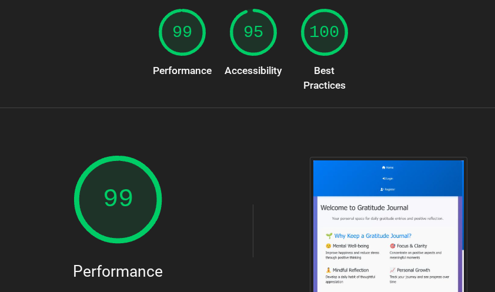

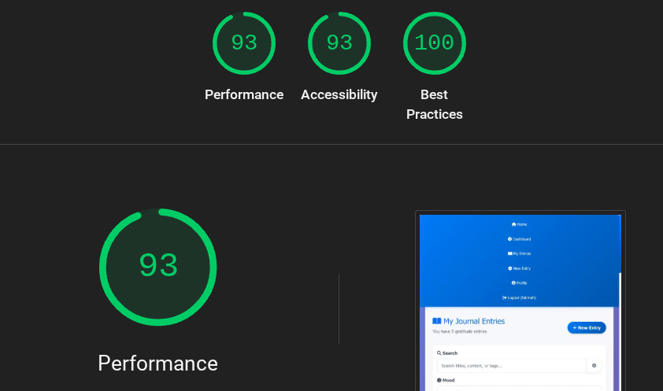

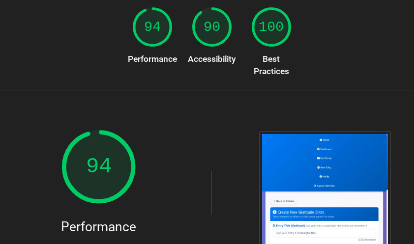

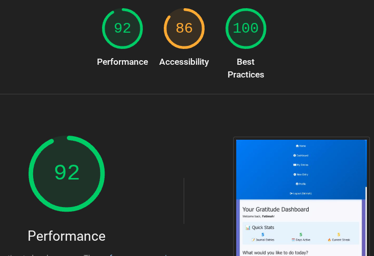

## Mobile Lighthouse Reports

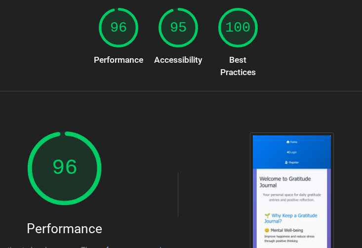

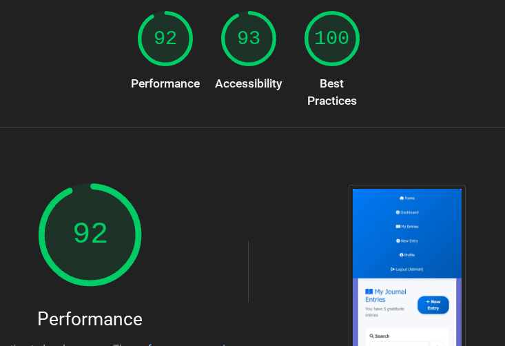

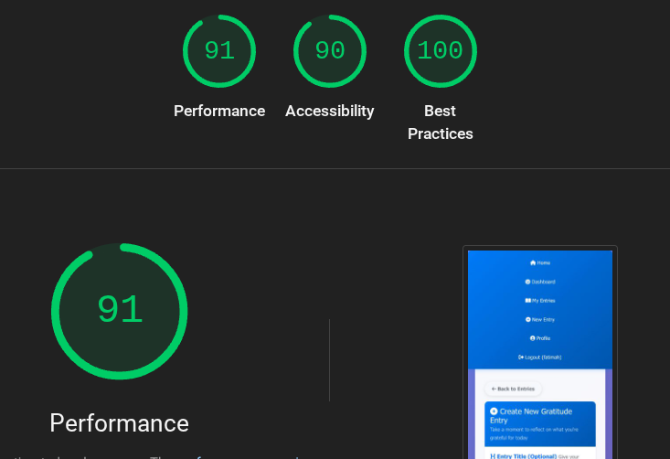

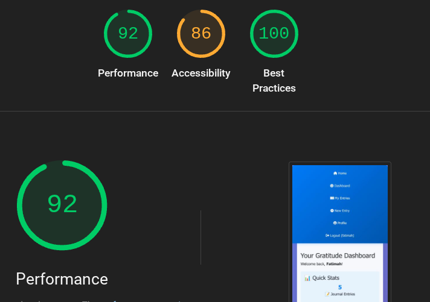

## HTML Validation

All pages were put through the w3 HTML validator and they all had no errors or warnings to show.

## CSS Validation

**Validation Context:**
The W3C CSS Validator has not been updated to fully recognize modern CSS3 features and framework patterns. These warnings indicate the use of:
- Advanced CSS3 specifications that are widely supported but not yet in the validator's ruleset
- Vendor prefixes that ensure cross-browser compatibility
- Framework-specific design patterns that are industry standard

The validator reported numerous warnings related to modern CSS features and third-party frameworks, which are expected and do not affect functionality or performance:

**Third-Party Framework Warnings:**

*FontAwesome 6 CSS Variables:*
- Animation delay and transform warnings for CSS custom properties (`var(--fa-animation-delay, 0)`, `var(--fa-rotate-angle, none)`)
- Vendor-specific webkit animation properties and keyframes
- These are legitimate CSS3 features used for dynamic animations

*Bootstrap 5 Framework:*
- Vendor-specific webkit/moz prefixes for cross-browser compatibility (`-webkit-font-smoothing`, `-moz-osx-font-smoothing`)
- CSS custom properties warnings ("Due to their dynamic nature, CSS variables are currently not statically checked")
- Vendor-extended pseudo-elements (`::-webkit-scrollbar`, `::-moz-placeholder`)
- Same color warnings for background and border (intentional design choices in Bootstrap)

*Modern CSS Features:*
- Vendor prefixes for animations, transforms, and transitions provide fallback support for older browsers
- CSS custom properties (variables) enable dynamic theming and component customization
- Vendor-extended pseudo-elements allow fine-grained control over browser-specific styling

**Custom Application CSS:** All custom styles written specifically for the Gratitude Journal application passed CSS validation without errors, ensuring clean, standards-compliant styling for the user interface components, animations, and responsive design elements.

## Python Validation

Code Institute's Python Linter was used. All python files has no errors.

## Javascript Validation

I used [code beautify](https://codebeautify.org/jsvalidate#) to validate my javascript. There were no errors to show. 

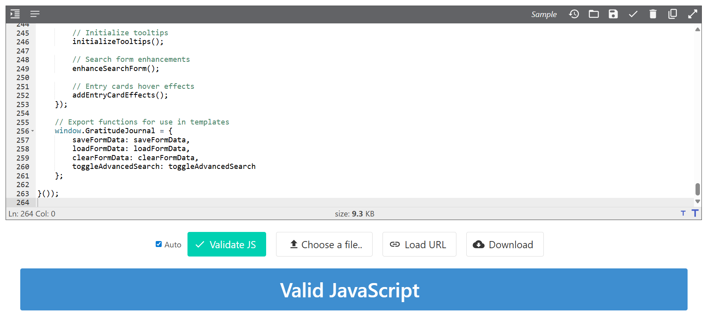

## Manual Testing

The application was tested manually to make sure user authentication and CRUD functionality were working. I also tested the accessibility and the responsiveness to different screen sizes. I found everything to be working fine.

## Automated Testing

I used chat GPT to implement comprehensive automated testing to ensure robust functionality and code reliability across all CRUD operations. The test suite consists of 26 automated tests covering three main areas:

**Test Coverage:**

**CRUD Operations Testing (18 tests)**

- Create: Tests for authenticated/unauthenticated access, valid/invalid data submission, and proper form handling

- Read: Entry listing, search functionality, mood filtering, pagination, and user-specific data isolation

- Update: Edit form access, data validation, unauthorized access prevention, and successful updates

- Delete: Confirmation views, successful deletion, and security restrictions

**User Authentication Testing (4 tests)**

- User registration with form validation
- Login/logout functionality
- Profile management and access control
- Proper URL redirections for unauthenticated users

**Model Testing (4 tests)**

- Database model creation with all fields
- Minimal field requirements and default values
- String representation formatting
- Proper data ordering (newest entries first)

**Security & Data Isolation**

Every test verifies that users can only access their own data, with 404 responses returned for unauthorized access attempts. The test suite validates that:

- Users cannot view, edit, or delete other users' entries
- Authentication is required for all protected operations
- Proper redirections occur for unauthenticated access

**Test Results**

All 26 tests passed successfully, providing confidence in the application's reliability and security. The automated testing ensures that future code changes won't break existing functionality and that all user interactions behave as expected in production.

# Future Enhancements
- Pre-defined templates for common gratitude themes
- Quick entry mode with minimal fields
- Voice-to-text capability for mobile users
- One-click entry creation from prompts
- Templates can be customized by user
- Quick entry still captures essential data (mood, content)
- Dashboard displays a daily gratitude prompt

# Credits

I would like to credit Code Institute, in particular the walk-through blog for aiding with the set up of the gratitutde journal. I would also like to credit chatGPT for its amazing assistance throughout the project.